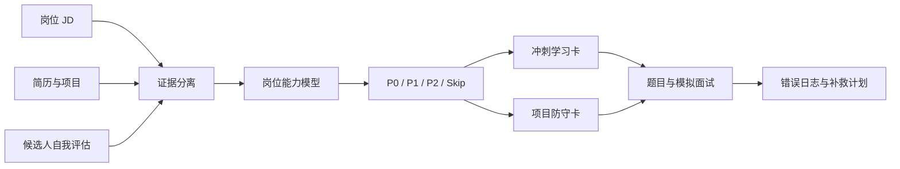

# Interview Crash Coach

> 根据真实岗位 JD、个人简历与自我评估，生成数小时到两天内可执行的技术面试冲刺计划，并支持自适应模拟面试。

`interview-crash-coach` 是一个面向 Codex 的可复用 Skill。它不试图生成一份面面俱到的长期学习路线，而是回答一个更现实的问题：

[OpenAI Codex Use Cases](https://developers.openai.com/codex/use-cases) 将 Skills 定位为保存可重复工作流、供 Codex 在后续任务中复用的扩展方式。

> 距离面试只剩几个小时或一两天时，候选人最应该补什么、练什么、如何证明自己已经会什么？

它会把岗位要求、简历证据和候选人口述信息分开处理，识别真正影响本轮面试的能力缺口，再将有限时间投入到高回报主题、项目防守和模拟追问中。

## 目录

- [适用场景](#适用场景)
- [核心能力](#核心能力)
- [工作原理](#工作原理)
- [三种工作模式](#三种工作模式)
- [安装](#安装)
- [快速开始](#快速开始)
- [建议提供的信息](#建议提供的信息)
- [输出内容](#输出内容)
- [时间分配策略](#时间分配策略)
- [模拟面试机制](#模拟面试机制)
- [证据与诚实性原则](#证据与诚实性原则)
- [项目结构](#项目结构)
- [定制与二次开发](#定制与二次开发)
- [验证](#验证)
- [局限与边界](#局限与边界)
- [设计参考](#设计参考)

## 适用场景

这个 Skill 适合以下情况：

- 明天、当天或几小时后就要进行实习或技术岗位面试；
- 已经拿到具体 JD，希望结合自己的简历确定复习优先级；
- 技术栈很宽，但没有时间完整学习所有主题；
- 担心面试官深入追问简历项目、性能数据或个人贡献；
- 希望生成中文技术面试题，并进行一问一答式模拟；
- 已完成一次模拟面试，希望根据暴露的问题安排最后补救；
- 想将同一套方法用于 NLP、后端、数据、算法、前端、研究或其他技术岗位。

它尤其适合技术实习面试，但流程本身不绑定某一种技术栈。

### 不适合的场景

- 制定数周或数月的完整转行课程；
- 代替真实项目经验或虚构候选人经历；
- 只做 ATS 关键词填充或自动改写整份简历；
- 在几小时内承诺掌握一个需要长期实践的复杂领域；
- 在没有候选人回答的情况下伪造模拟面试成绩。

## 核心能力

### 1. JD 与简历证据对齐

Skill 会将 JD 拆分为：

- 核心职责；
- 必备能力；
- 加分项；
- 业务领域知识；
- 可能出现的面试信号；
- 决定岗位性质的关键能力。

随后逐项检查简历或项目经历是否存在可被追问的证据，并标记为：

- `proven`：简历中存在直接、具体证据；
- `partial`：有相关经历，但深度或场景不完全匹配；
- `self-reported-only`：候选人表示会，但简历没有体现；
- `missing`：已确认缺少；
- `unknown`：材料没有说明，尚未向候选人确认。

这里衡量的是 **resume-evidence fit（简历证据匹配度）**，不是候选人的真实能力分数。

### 2. 面向截止时间的优先级排序

每个能力缺口会综合考虑：

```text
优先级信号 =
  0.40 × 岗位关键性
+ 0.25 × 证据缺口
+ 0.20 × 面试出现概率
+ 0.15 × 短期可学习性
```

这个公式用于约束判断，不用于制造虚假的精确分数。以下语义规则拥有更高优先级：

- 岗位核心职责所依赖、但候选人没有证据的能力，直接提升为 P0；
- 无法在剩余时间内真正掌握的主题，改为准备原理、处理思路和诚实边界；
- 简历中醒目的数字、架构和成果，即使属于优势，也必须进入项目防守；
- 多个缺口能通过同一张图、一个查询或一个小练习覆盖时，合并学习。

### 3. 文档优先的冲刺学习卡

每个入选主题都会生成一张时间受限的学习卡：

1. 为什么面试官可能问；
2. 必须理解的 3–5 个概念；
3. 当前官方文档或原始资料中应阅读的具体章节；
4. 阅读时间和停止条件；
5. 闭卷复述、查询、图示或小练习；
6. 与 JD 相关的面试回答骨架；
7. 时间富余时再看的视频或论文。

Skill 不会只丢出一个泛泛的课程链接，也不会推荐一门比剩余准备时间还长的课程。

### 4. 简历项目与数字声明防守

对最可能被追问的项目和成果，Skill 会要求候选人确认：

- 问题、用户和实际业务目标；
- 自己的贡献与团队贡献；
- 数据流、架构和关键技术选择；
- 被拒绝的替代方案；
- 指标定义、基线、样本和测量方法；
- 失败案例、限制和后续改进；
- 数据量或流量增长十倍后的变化；
- 该项目与目标岗位职责的连接。

这部分的目标不是把答案包装得更华丽，而是避免在追问中出现前后矛盾。

### 5. 自适应模拟面试

模拟面试不是一次性生成题库。Skill 会：

- 每次只问一道题并等待回答；
- 对模糊表述要求具体例子；
- 对数字追问基线、定义和测量方式；
- 对架构追问数据流、失败路径和替代方案；
- 根据回答质量动态调整难度；
- 记录知识、证据、推理、表达和边界处理错误；
- 最后把暴露的问题转换为剩余时间内可执行的补救计划。

## 工作原理



整个流程坚持三个独立证据源：

| 证据源 | 内容 | 用途 |
|---|---|---|
| `jd_evidence` | JD 的职责、要求、偏好和领域背景 | 判断岗位真正要交付什么 |
| `resume_evidence` | 简历、项目、课程、指标和作品链接 | 判断面试中可直接主张什么 |
| `candidate_report` | 候选人口述但简历未体现的信息 | 调整学习时间，不自动升级为简历证据 |

## 三种工作模式

### Cram-plan：冲刺计划

适用于：JD/简历差距分析、学习资料、复习日程、预测题和最终速记页。

示例：

```text
$interview-crash-coach

这是岗位 JD 和我的简历。距离中文技术面试还有 6 小时。
请先区分简历证据和我的自我评估，再生成文档优先的冲刺计划、
项目防守卡、必答问题和最后 15 分钟复习页。
```

### Live-mock：实时模拟面试

适用于：按真实面试节奏一问一答，并根据回答继续追问。

示例：

```text
$interview-crash-coach 进入 live-mock 模式。

目标是后端开发实习技术一面，中文，30 分钟。
项目深挖占一半，不要提前告诉我标准答案；面试结束后统一评分。
```

### Answer-review：答案复盘

适用于：复盘模拟面试记录、真实面试回忆、语音转写或已有回答。

示例：

```text
$interview-crash-coach 使用 answer-review 模式分析下面的面试记录。

请按正确性、深度、证据、结构和边界意识评分，
找出三个最高风险点，并给出 90 分钟补救计划。
```

三种模式可以组合，但在只剩几个小时的情况下，建议先完成冲刺计划，再进行一次短模拟。

## 安装

### 方法一：让 Codex 安装

在 Codex 中发送：

```text
请从下面的 GitHub 仓库安装 interview-crash-coach Skill：
https://github.com/hsmymb/interview-crash-coach
```

Codex 可以使用可用的 Skill 安装能力，将仓库安装到个人 Skills 目录。

### 方法二：手动安装

仓库根目录本身就是 Skill 根目录。将其克隆到：

```text
$CODEX_HOME/skills/interview-crash-coach
```

如果没有设置 `CODEX_HOME`，个人 Codex 目录通常位于用户目录下的 `.codex`。

Windows PowerShell：

```powershell
$codexRoot = if ($env:CODEX_HOME) {
    $env:CODEX_HOME
} else {
    Join-Path $env:USERPROFILE '.codex'
}

git clone https://github.com/hsmymb/interview-crash-coach.git `
    (Join-Path $codexRoot 'skills\interview-crash-coach')
```

macOS / Linux：

```bash
codex_root="${CODEX_HOME:-$HOME/.codex}"
git clone https://github.com/hsmymb/interview-crash-coach.git \
  "$codex_root/skills/interview-crash-coach"
```

安装后新建一个 Codex 任务。如果 Skill 列表没有立即刷新，请重启 Codex。

## 快速开始

### 1. 准备输入

至少提供：

- 完整岗位 JD；
- 当前使用的简历或项目经历；
- 距离面试的时间和实际可学习时长。

可以使用文本、截图、PDF、DOCX 或链接。能否直接解析某种格式取决于当前 Codex 环境可用的文件和浏览能力。

### 2. 调用 Skill

```text
$interview-crash-coach
```

也可以直接使用自然语言触发，例如：

```text
根据这份 JD 和简历，给我做一个明天面试前的中文技术面冲刺计划，
重点准备项目深挖和岗位核心知识，资料以文档为主。
```

### 3. 回答一次紧凑的补充提问

如果材料中没有说明，Skill 只会询问真正影响方案的内容：

1. 剩余时间和可用学习时长；
2. 面试轮次、形式和语言；
3. 对明显能力缺口的自我评估；
4. 希望获得学习包、静态题目、实时模拟或组合输出。

已经提供过的信息不会被重复询问。

## 建议提供的信息

下面的输入模板可以提高结果质量：

```markdown
## 截止时间
- 面试时间：
- 真正能用于准备的小时数：

## 面试形式
- 岗位：
- 轮次：技术一面 / 二面 / HR 面 / 其他
- 形式：项目深挖 / 算法题 / 系统设计 / 综合
- 语言：

## 材料
- JD：粘贴、附件或链接
- 简历：粘贴或附件
- 相关项目/作品链接：

## 自我评估
- 熟悉：
- 了解但不熟：
- 完全陌生：
- 简历没有写但实际做过：

## 希望输出
- 冲刺学习资料：是/否
- 预测题：是/否
- 实时模拟：是/否
- 答案复盘：是/否
```

## 输出内容

根据剩余时间，Skill 会选择最小可用模板。完整输出可能包括：

### 岗位判断

- 岗位真正需要交付的结果；
- 最强匹配证据；
- 决定录用结果的主要风险；
- 本次面试的准备策略。

### 证据矩阵

| 岗位能力 | JD 依据 | 简历证据 | 候选人口述 | 状态 | 优先级 |
|---|---|---|---|---|---|

### 钟表时间计划

| 时间 | 任务 | 资料与章节 | 必须产出 | 停止条件 |
|---|---|---|---|---|

### 学习卡

- 面试目的；
- 必须理解的概念；
- 官方资料具体章节；
- 闭卷验证任务；
- 回答骨架；
- 时间富余资源。

### 项目防守卡

- 项目一句话定义；
- 个人贡献；
- 架构与数据流；
- 指标审计；
- 取舍和失败案例；
- 与 JD 的连接。

### 面试题与速记页

- Must answer：必须稳定回答；
- Likely：高概率邻接问题；
- Stretch：时间充足时再准备；
- 最后 15 分钟复习清单；
- 明确跳过的低回报主题。

## 时间分配策略

### P0 主题数量上限

| 可用时间 | 建议最多主动学习的 P0 主题 |
|---|---:|
| 不超过 3 小时 | 2 |
| 半天 | 3 |
| 1 天 | 4 |
| 2 天 | 5 |

### 默认时间档位

| 档位 | 重点 |
|---|---|
| ≤3 小时 | 两个关键缺口、项目与指标防守、快速题目回忆、短模拟 |
| 4–6 小时 | 2–3 张 P0 学习卡、项目深挖、题目演练、一次模拟 |
| 6–10 小时 | 3–4 个主题、一个小型证明产物、系统化项目防守 |
| 12–20 小时 | 分两天学习、制作窄范围产物、两次模拟和错误驱动复习 |

如果用户只说“尽快”，Skill 默认按四小时紧急计划处理，并明确标注这个假设。

### 静态题目数量上限

| 可用时间 | Must answer | Likely | Stretch |
|---|---:|---:|---:|
| ≤3 小时 | 6–8 | ≤4 | 0 |
| 4–6 小时 | ≤10 | ≤6 | ≤2 |
| 1–2 天 | ≤12 | ≤8 | ≤4 |

题目上限用于防止“生成了很多、实际一道也没有练熟”的准备过载。

## 模拟面试机制

### 默认题目构成

| 题目来源 | 建议占比 |
|---|---:|
| 简历项目深挖 | 40%–55% |
| JD 核心知识 | 30%–40% |
| 应用设计、编码或查询 | 10%–20% |
| 动机与能力边界 | 5%–10% |

具体比例会根据岗位和面试形式调整。例如，没有算法题环节的技术实习面试会更偏向项目深挖和应用概念。

### 回答评分

每个回答按 0–4 分评价五个维度：

| 维度 | 关注点 |
|---|---|
| Correctness | 技术结论是否正确、精确、无矛盾 |
| Depth | 是否解释机制、取舍和边缘情况 |
| Evidence | 是否提供具体且归属清楚的项目证据 |
| Structure | 是否结论先行、简洁且容易追踪 |
| Boundaries | 是否诚实说明限制并给出合理处理思路 |

诚实承认未知不会像自信地传播错误信息那样受到严重扣分。虚构个人贡献、数据或生产经验会被重点标记。

## 证据与诚实性原则

本项目将以下规则视为硬约束：

- 不因为简历没写某个关键词，就断言候选人不会；
- 不把候选人口述信息自动写成简历证据；
- 不虚构公司信息、项目规模、样本量、指标或代码仓库；
- 不替候选人编造个人贡献和团队边界；
- 不用“匹配度”冒充真实能力评分；
- 对无法短期掌握的主题，准备诚实边界和解决路径；
- 每个学习优先级都应能追溯到 JD；
- 每项优势都应能追溯到候选人材料。

### 隐私建议

简历和 JD 可能包含姓名、电话、邮箱、公司内部信息或未公开项目。建议：

- 在本地 Codex 会话中处理原始材料；
- 不要把个人简历、真实面试记录或保密 JD 提交到这个仓库；
- 分享结果前删除个人身份信息和公司敏感数据；
- 对公开作品链接，只基于可观察内容进行判断。

## 项目结构

```text
interview-crash-coach/
├── SKILL.md
├── README.md
├── agents/
│   └── openai.yaml
└── references/
    ├── analysis-and-planning.md
    ├── mock-interview.md
    └── output-templates.md
```

| 文件 | 作用 |
|---|---|
| `SKILL.md` | 触发条件、主流程、硬约束和质量检查 |
| `agents/openai.yaml` | Codex UI 展示名称、简介和默认提示词 |
| `references/analysis-and-planning.md` | 证据矩阵、优先级、时间档位和泛化规则 |
| `references/mock-interview.md` | 出题比例、动态追问、评分和错误修复协议 |
| `references/output-templates.md` | 紧急冲刺、完整学习包、速记页和答案复盘模板 |

## 定制与二次开发

### 调整时间档位

编辑：

```text
references/analysis-and-planning.md
```

可以修改不同时间窗口的学习块、P0 数量和允许的证明产物。

### 调整模拟面试风格

编辑：

```text
references/mock-interview.md
```

可以调整项目深挖比例、题型分布、评分维度和是否允许 coaching mode。

### 调整交付格式

编辑：

```text
references/output-templates.md
```

可以增加团队内部模板、特定学校格式或岗位类别模板，但不建议把具体技术栈硬编码进通用流程。

### 扩展原则

新增能力时建议继续遵循：

1. 课程内容由每份 JD 动态推导；
2. 通用 Skill 只保存分析流程和质量标准；
3. 新增输出必须适应真实截止时间；
4. 所有结论都能追溯到输入证据；
5. 不通过增加题目数量掩盖优先级判断不足。

## 验证

项目使用 Codex 内置 `skill-creator` 的快速校验器检查 Skill 结构：

```powershell
$codexRoot = if ($env:CODEX_HOME) {
    $env:CODEX_HOME
} else {
    Join-Path $env:USERPROFILE '.codex'
}

python (Join-Path $codexRoot 'skills\.system\skill-creator\scripts\quick_validate.py') .
```

当前版本已通过：

```text
Skill is valid!
```

除结构校验外，设计阶段还使用了与原始 NLP 案例不同的后端岗位样例进行泛化测试，以检查：

- 是否会把 NLP/图谱主题错误带入无关岗位；
- 是否能根据 Java、JVM、数据库和缓存要求重新构建课程；
- 是否能在两小时窗口内主动压缩题目数量；
- 是否会审计简历中的性能数字和个人贡献。

## 局限与边界

- 输出质量依赖 JD 和简历信息的完整程度；
- 面试概率只是基于岗位与候选人证据的推断，不是招聘方承诺；
- 技术资料的时效性依赖当前环境是否允许浏览官方文档；
- Skill 可以帮助组织短期学习，但不能代替真实编码、实验或生产经验；
- 静态题库无法替代候选人真实回答后的动态追问；
- 不同公司和面试官可能采用完全不同的考察方式；
- 当前版本以文本交互为主，不包含独立语音面试前端。

## 设计参考

这个项目在设计阶段调研并借鉴了以下社区项目的思路：

- [MadsLorentzen/ai-job-search](https://github.com/MadsLorentzen/ai-job-search)：`upskill` 工作流中的岗位差距热力图、学习资源和时间估计；
- [Paramchoudhary/ResumeSkills](https://github.com/Paramchoudhary/ResumeSkills)：JD 分析、简历证据和面试准备的组合思路；
- [onewave-ai/claude-skills](https://github.com/onewave-ai/claude-skills)：`job-application-optimizer` 的求职材料优化视角。

`interview-crash-coach` 在这些方向上进一步聚焦：

- 数小时到两天的极短时间窗口；
- JD、简历与候选人口述的证据分离；
- 岗位关键性优先于关键词频率；
- 简历项目、数字和个人贡献防守；
- 一问一答式自适应模拟面试；
- 根据错误日志生成剩余时间内的补救计划；
- 跨技术岗位泛化，而不是绑定单一 NLP 案例。

本仓库的流程、约束和模板按上述目标重新组织。引用社区项目不代表它们对本项目提供背书。

## 贡献

欢迎通过 Issue 或 Pull Request 提交：

- 新的匿名岗位测试案例；
- 更可靠的优先级和时间分配方法；
- 模拟面试评分改进；
- 对不同技术岗位的泛化测试；
- 安装和兼容性问题；
- 文档错误或更清晰的示例。

提交测试案例时，请删除姓名、联系方式、公司保密信息和无法公开的项目数据。

---

如果你只有一句话可以开始，可以直接说：

```text
$interview-crash-coach 我明天有一场中文技术面试，这是 JD 和简历。
请把所有建议压缩到我真正能完成的时间里，并优先追问简历项目。
```
